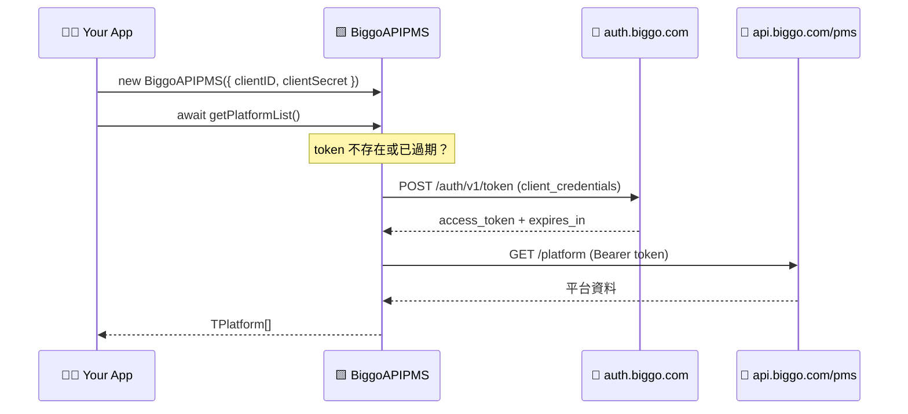
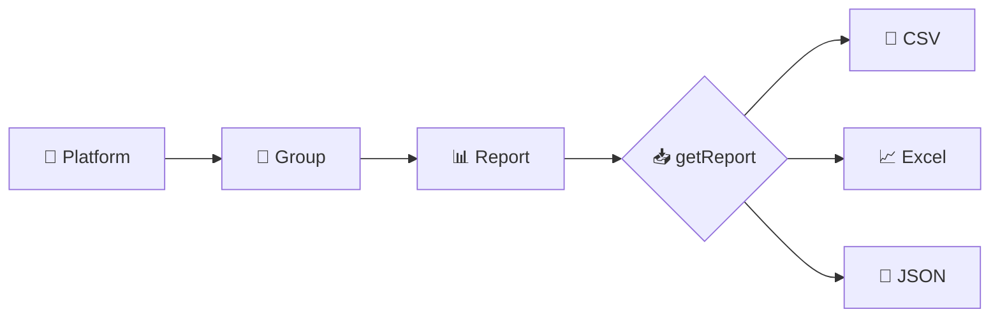

# 🟨 BigGo API PMS — JavaScript / TypeScript Client

> 🛒 BigGo PMS (Price Monitoring System) 的官方 JS/TS client，讓你用幾行程式碼就能存取平台、群組與歷史報表。

[](https://www.npmjs.com/package/biggo-api-pms)
[](https://www.typescriptlang.org/)
[](./LICENSE)

---

## ✨ Features

- 🔑 **自動 token 管理** — 自動處理 OAuth2 `client_credentials` 換發與過期續期
- 🏬 **平台 / 群組 / 報表** — 完整存取 PMS 資源階層
- 📦 **多格式下載** — 支援 `csv` / `excel` / `json` 報表下載，可直接存檔
- 🧩 **TypeScript 原生支援** — 內建完整型別定義
- ⚡ **ESM & CJS** — 同時支援兩種模組系統

---

## 📑 Table of Contents

- [🚀 Getting Started](#-getting-started)
  - [📥 Installation](#-installation)
  - [🔧 Usage](#-usage)
  - [🏗️ Initializing](#️-initializing)
  - [📡 Accessing BigGo API PMS](#-accessing-biggo-api-pms)
- [🧭 How It Works](#-how-it-works)
- [📚 API Reference](#-api-reference)
- [🟦 TypeScript](#-typescript)
- [📄 License](#-license)

---

## 🚀 Getting Started

### 📥 Installation

```shell
# npm
npm i biggo-api-pms --save

# yarn
yarn add biggo-api-pms

# pnpm
pnpm add biggo-api-pms
```

### 🔧 Usage

```js
// ESM
import { BiggoAPIPMS } from "biggo-api-pms"

// CJS
const { BiggoAPIPMS } = require("biggo-api-pms")
```

### 🏗️ Initializing

先從 BigGo API 取得 client id 與 secret，再用以下程式碼建立 API 物件：

```js
const api = new BiggoAPIPMS({
  clientID: '<Your client ID>',
  clientSecret: '<Your client secret>'
})
```

> 💡 還沒有 client id / secret？請參考 👉 [Funmula-Corp/guide](https://github.com/Funmula-Corp/guide)

### 📡 Accessing BigGo API PMS

```js
// 🏬 取得使用者可存取的平台列表
const platformList = await api.getPlatformList()

// 👥 取得平台內的群組列表
const groupList = await api.getGroupList('<Platform ID>')

// 📊 取得平台內的歷史報表列表
const reportList = await api.getReportList('<Platform ID>')

// 📥 取得報表內容，或直接存成檔案
const reportJson = await api.getReport('<Platform ID>', '<Report ID>', 'json')
```

> 📖 更多細節請參考 [完整文件](./lib/api/README.md)。

---

## 🧭 How It Works

🔐 **認證流程**：SDK 會在第一次請求時自動換發 token，並在過期前自動續期。



🗂️ **資源階層**：平台底下有群組，群組會產生報表，報表可下載成多種格式。



---

## 📚 API Reference

| 方法 | 說明 | 回傳 |
| --- | --- | --- |
| `getPlatformList()` | 🏬 取得可存取的平台列表 | `Promise<TPlatform[]>` |
| `getGroupList(platformID)` | 👥 取得平台內的群組列表 | `Promise<TGroup[]>` |
| `getReportList(platformID, options?)` | 📊 取得歷史報表列表 | `Promise<TReportListItem[]>` |
| `getReport(platformID, reportID, fileType, options?)` | 📥 下載報表（`csv`/`excel`/`json`） | `Promise<string \| Uint8Array>` |
| `setToken(token, expiresAt, tokenType?)` | 🔑 手動設定 token | `this` |
| `isTokenExpired()` | ⏳ 檢查 token 是否過期 | `boolean` |

`getReportList` 的 `options` 可帶 `size`、`sort`、`startIndex`、`groupID`、`startDate`、`endDate`。
`getReport` 的 `options` 可帶 `saveAsFile`、`saveDir`、`fileName`。

---

## 🟦 TypeScript

本套件以 TypeScript 撰寫，內建完整型別定義，安裝後即可獲得自動補全與型別檢查，無需另外安裝 `@types`。

---

## 📄 License

[MIT](./LICENSE)
